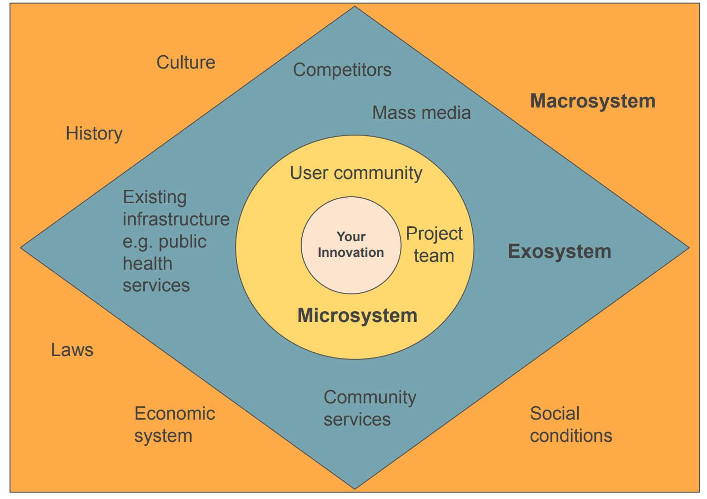

# Ecological Systems Thinking

This diagram and example below offers a framework through which you can understand how your idea or intervention relates to its community, the wider society and large scale systems. The theory is also commonly referred to as the ecological/systems framework. It identifies five environmental systems within which your innovations interacts. You may want to use this as a framework for thinking about how your idea could work in practice, by sketching out the key interactions at each layer of the diagram.

Between each level of external influence (Micro/Exo/Macro) there are various relationships with cause and effect. These levels are categorised from the most intimate level (Micro) where personal relationships play out, to the broadest (Macro) which are large scale systems of influence.

## Example: Your innovation – a women led DAO for maternity care

**Microsystem:** This is the relationship between the community of women who will use your technology and the direct team who are developing it.

**Exosystem:** This is the wider context in which the DAO will be active - some of this will have a direct impact and some indirect. For example the existing public health services, community services and ways people access care in their community.

**Macrosystem:** These are the large scale conventions and infrastructures within which your innovation will fit. For example laws around reproduction, sex and child bearing in the community context. Local cultures and ways of organisation are influenced by historical events in each locality.

**Chronosystem**: This is the environmental context of the whole system over time: it includes planetary and climate impact, international relations, and interplanetary activity.
